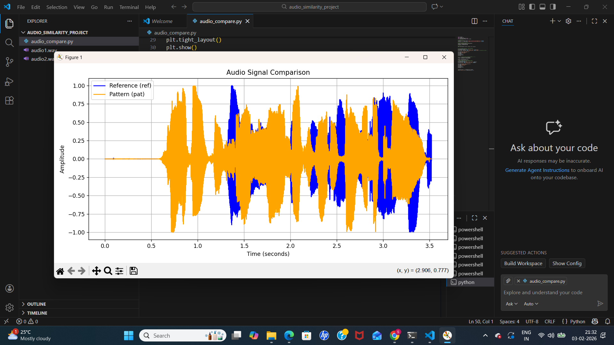
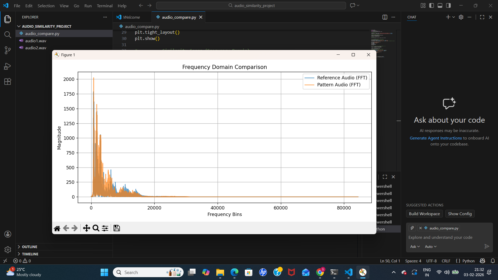
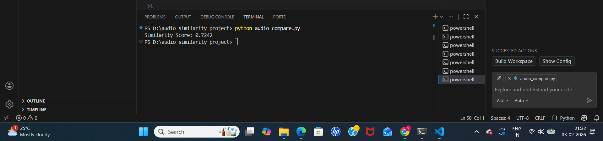

# Audio Frequency Comparison and Voice Similarity Evaluation

## Objective
This project compares two audio recordings using frequency-domain analysis
to determine how similar they are.

## Tools & Libraries Used
- Python
- Librosa
- NumPy
- Matplotlib
- SciPy

## Methodology
1. Load two audio files
2. Normalize and match audio lengths
3. Perform FFT (Fast Fourier Transform)
4. Plot frequency-domain comparison
5. Calculate similarity using cosine similarity

## Output
- Frequency-domain graph showing both audio signals
- Similarity score between the two audio files

## 📊 Output

### 1️⃣ Time Domain Comparison


### 2️⃣ Frequency Domain Comparison


### 3️⃣ Similarity Score (Terminal Output)


## How to Run
```bash
pip install librosa numpy matplotlib scipy
python audio_compare.py
